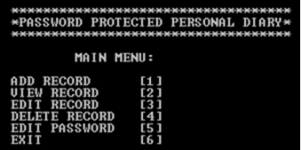
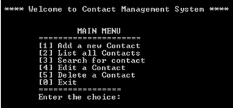

# Lab Task 03

Introduction to C.

## Question 1

Write a program to print the given menu:  

## Question 2

Write a program that prints the following Menu on the screen.  

*Check out my [Github Repo](https://github.com/FurqaHun/PF-LTS "Repo contains all the other tasks too ;)") if you want to see more tasks*  

[FurqanHun Instagram](https://www.instagram.com/furqan_hi_hun "Follow me on insta ;)")  
[FurqanHun Github](https://github.com/FurqanHun "Follow my Github profile")  
[FurqanHun LinkedIn](https://www.linkedin.com/in/FurqanHun "Connect with me on LinkedIn")